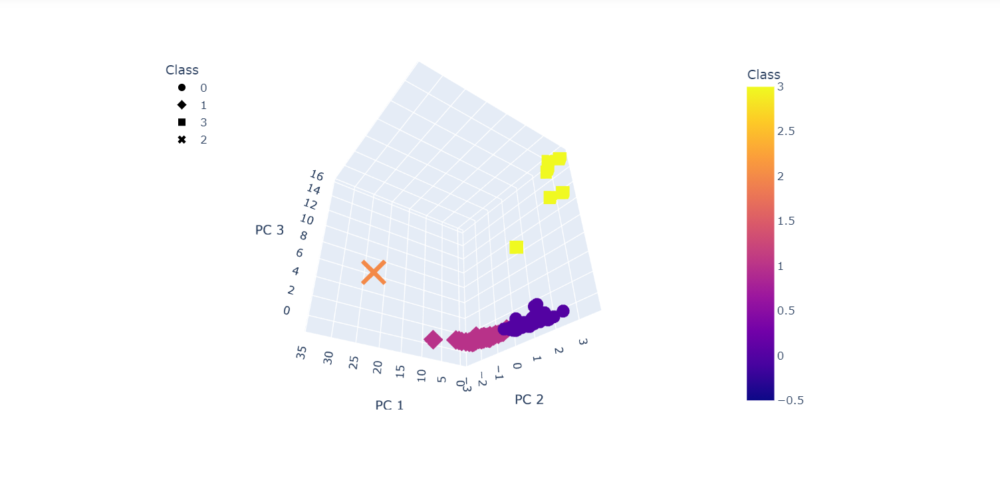
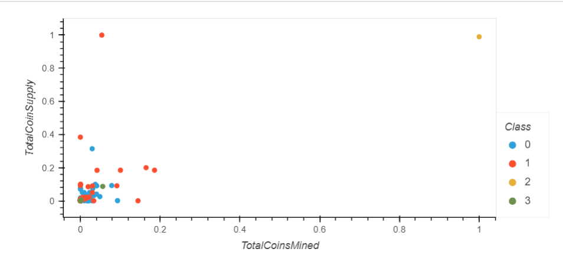

# **Cryptocurrencies**

## **Overview of Project:**
The purpose of this project was to utilize unsupervised machine learning to develop predictions on cryptocurrency  data. The following was achieved during this project: 

1. Preprocessing and cleaning of data using Pandas
2. Using Principal Component Analysis (PCA) to make a predictive model
3. Using the K-means method to cluster the data into classes
4. Visualizing the results above with Holoviz plots and Plotly 

## **Results:**
Here are some of the visualizations that were developed: 
  

### **3D scatter chart:**

  

### **2D scatter chart:**
